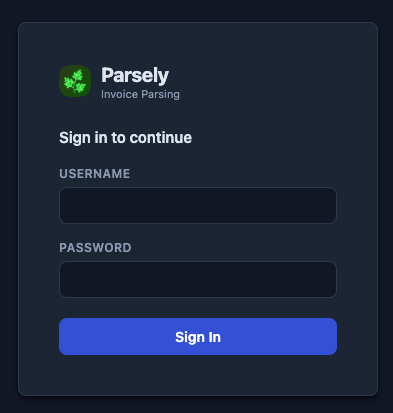
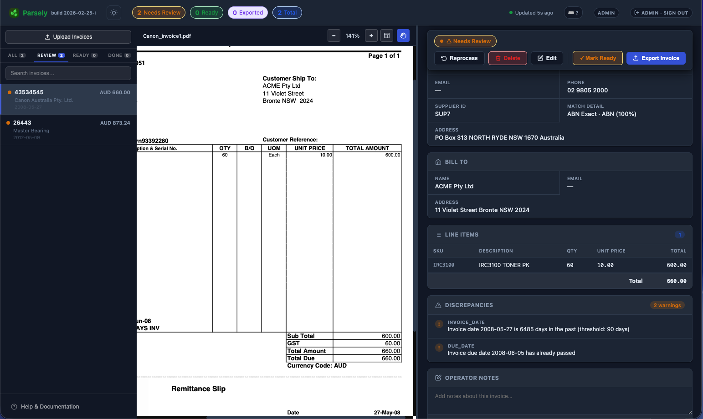
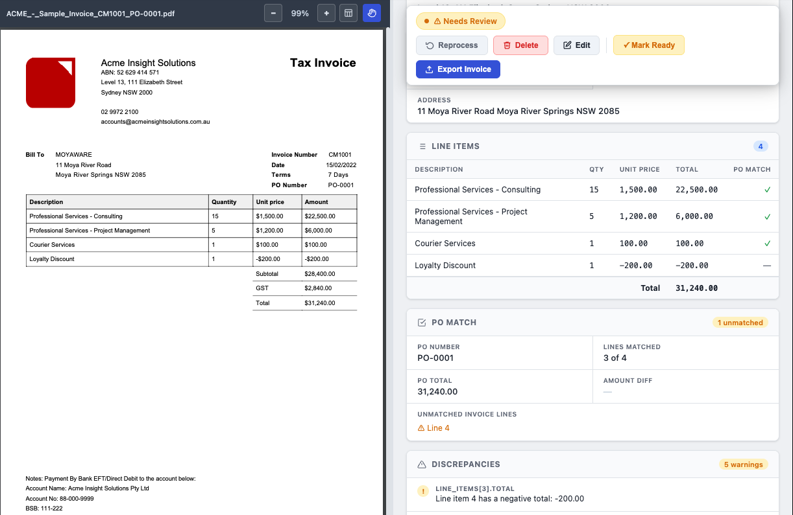
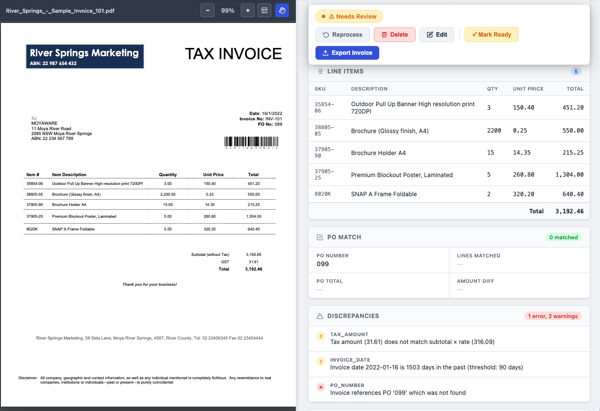
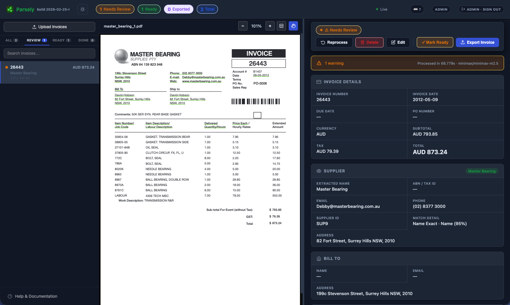
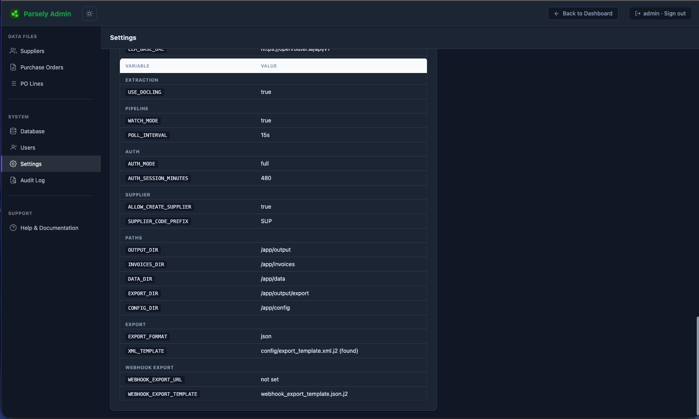
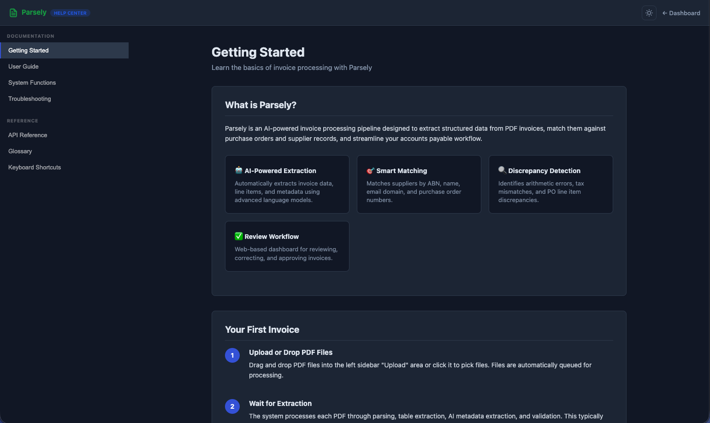
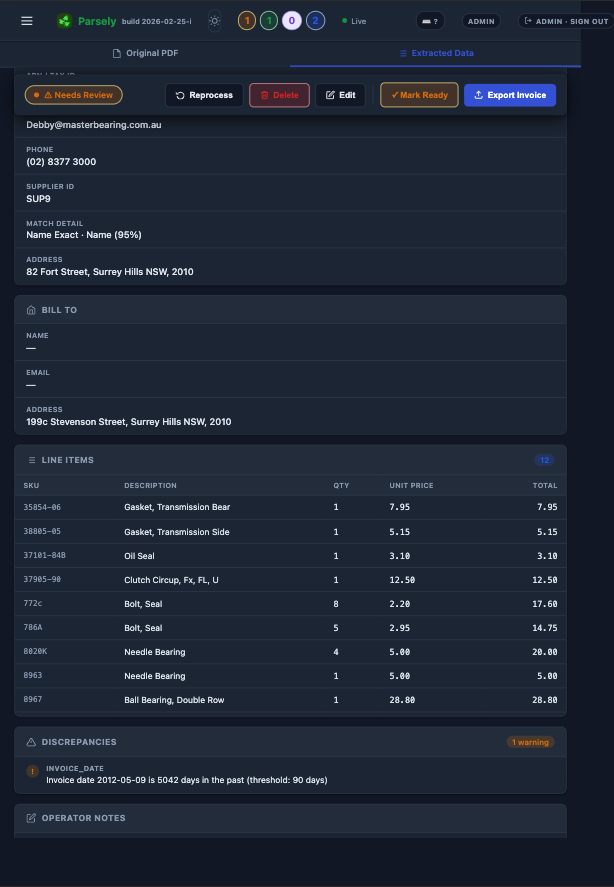

# Parsely — Invoice Processing

An AI-powered invoice processing pipeline that extracts  and parses structured data from PDF invoices, matches them against Purchase Orders and a supplier master list, flags discrepancies, and surfaces everything through a web dashboard.

**Docker is the recommended way to run Parsely.** All dependencies — Python, Docling ML models, PDF rendering tools — are bundled in the image.

---

## Features

- **Interactive PDF Highlighting** — Visually verify extracted data by hovering or clicking fields in the dashboard; features stream offset mapping and row-locking for absolute precision.
- **Buyer Anchoring** — Prevents self-identification by using an "Internal Companies" list to help the AI distinguish between the sender and the receiver.
- **Dynamic Custom Fields** — Define fields with multiple sources: `llm` (automated), `text` (manual), or `lookup` (CSV-based dropdowns).
- **Layout-aware PDF extraction** — Docling preserves table structure and handles multi-column layouts; pdfplumber provides supplementary table extraction.
- **OCR support** — Built-in OCR handles scanned/image PDFs automatically.
- **Structured LLM extraction** — Works with any OpenAI-compatible API: local Ollama, OpenAI, Groq, or hosted models.
- **Direct table extraction** — Line items are parsed directly from PDF tables where possible, reducing tokens and improving accuracy.
- **Webhook Export** — Automatically push approved invoice data to external REST APIs (e.g. Therefore DMS, Xero, ERP) using Jinja2 templates.
- **Modern Web Dashboard** — Glassmorphism UI with side-by-side review, keyboard shortcuts, and dark mode.
- **Admin Management** — Category-based settings; manage suppliers, internal entities, and custom fields directly in-browser.

---

## Prerequisites

- [Docker](https://docs.docker.com/get-docker/) and [Docker Compose](https://docs.docker.com/compose/install/) (v2)
- **Local LLM (Recommended)**: [Ollama](https://ollama.com) running locally.
    - *Hardware Tip*: For an **NVIDIA RTX 4070 Super (12GB VRAM)**, we recommend the **Mistral NeMo 12B** or **Qwen 2.5 14B** models for the best balance of speed and accuracy.
- **Hosted LLM (Optional)**: OpenAI API key or [Groq](https://console.groq.com) API key.

---

## Quick Start

### 1. Clone and configure

```bash
git clone https://github.com/Fybre/parsely-invoices.git
cd parsely-invoices
cp .env.example .env
```

Open `.env` and set your LLM connection details. For local Ollama on the host:
`LLM_BASE_URL=http://host.docker.internal:11434/v1`

### 2. Ingestion Methods

Parsely monitors multiple sources for new invoices:
- **Web Dashboard**: Drag-and-drop PDF files directly into the sidebar.
- **Email**: Enable IMAP ingestion in Admin settings to automatically process attachments from a dedicated mailbox.
- **Local Folder**: Any PDF moved into the `./invoices` directory is automatically queued.

### 3. Build and Start

```bash
docker compose build
docker compose up -d dashboard
```

> **Note:** On first run, Docling downloads ~1 GB of ML models into a named volume (`docling-models`).

### 3. Verify your setup

```bash
docker compose run --rm pipeline check
```

Open **http://localhost:8080** in your browser.

---

## Dashboard & Admin

### Main Dashboard
Access at **http://localhost:8080**.
- **Upload**: Drag-and-drop or click to upload PDF invoices.
- **Review**: Side-by-side PDF viewer and extracted data panel.
- **Correct**: Edit any extracted field inline; corrections are stored separately and applied on export.
- **Export**: Approve individual or bulk-export all 'ready' invoices.

### Admin Page
Access at **http://localhost:8080/admin**.
- **Settings**: Categorized configuration for Thresholds, Webhook Export, and Automated Backups.
- **Test Webhook**: Use the "Test Webhook" button to verify your external integration with dummy data and see real-time console debug output.
- **Edit CSVs**: Manage your suppliers and purchase orders directly in the browser.
- **Reload**: Click "Reload into Pipeline" to push CSV changes to the running worker without a restart.

### Screenshots

**Login Page**  


**Invoice Review (Dark Mode)** — Side-by-side PDF viewer with extracted data, supplier matching, and discrepancy warnings  


**Invoice Review with PO Matching (Light Mode)** — Purchase order matching with line item comparison  


**Invoice with Discrepancies** — Detailed discrepancy detection showing tax errors and unmatched PO references  


**Invoice Review with Warnings** — Invoice with line items and discrepancy warnings for date validation  


**Admin Settings** — Categorized configuration management for extraction, pipeline, auth, and export settings  


**Help Documentation** — In-app help system with getting started guide  


**Invoice Details (Mobile)** — Responsive mobile view of invoice details with line items  


---

## External Integrations (Webhooks)

Parsely can push approved data to any REST API. Configure this in the **Admin > Settings** section.

- **Webhook Export URL**: Your API endpoint (e.g. `https://acme.thereforeonline.com/theservice/v0001/restun/CreateDocument`).
- **Templates**: Uses Jinja2 templates located in the `config/` folder. A specialized template for **Therefore DMS** is included by default.
- **Custom Headers**: Add API keys or Tenant IDs as a JSON object (e.g. `{"Authorization": "Bearer ...", "TenantName": "acme"}`).
- **PDF Support**: Toggle whether to include the Base64-encoded PDF in the webhook payload.

---

## Automated Backups

Backups are performed automatically by the background pipeline process.
- **Interval**: Configurable frequency (default: 24 hours).
- **Retention**: Automatically keeps the last N archives (default: 7).
- **Manual Backup**: You can trigger a backup manually via the CLI:
  ```bash
  docker compose run --rm pipeline backup
  ```
Archives are stored in the `backups/` volume as timestamped ZIP files containing the database, config, and master data CSVs.

---

## Configuration (.env)

| Setting | Description |
|---|---|
| `LLM_BASE_URL` | API endpoint (OpenAI-compatible) |
| `LLM_MODEL` | Model name (e.g. `qwen2.5:7b`, `llama3.2`) |
| `LLM_API_KEY` | API key (`ollama` for local) |
| `AUTH_MODE` | `disabled` \| `admin_only` \| `full` |
| `WATCH_MODE` | `true` for continuous polling; `false` for one-shot |
| `POLL_INTERVAL` | Seconds between scans in watch mode (default: 30) |

---

## Project Structure

```
parsely-invoices/
├── config/                      Operator-editable config (mounted)
│   ├── custom_fields.json       Site-specific extraction fields
│   ├── column_keys.json         Column header synonyms
│   ├── pipeline_settings.json   Admin-managed settings (auto-generated)
│   └── *.j2                     Export and Webhook templates
├── defaults/                    Factory default config files (image bundled)
├── pipeline/                    Core processing logic
│   ├── services/                Business logic layer
│   │   ├── export.py            Export normalization & formatting
│   │   └── pdf.py               PDF rendering utilities
│   ├── csv_manager.py           Shared CSV loading/management
│   ├── webhook_export.py        External API integration service
│   ├── backup.py                Automated backup logic
│   └── ...                      Matchers, Extractors, Parsers
├── dashboard/                   FastAPI web interface
│   ├── models/                  Pydantic request models
│   └── templates/               HTML templates
├── tests/                       Test suite
│   ├── unit/                    Unit tests (37 tests)
│   └── integration/             Integration tests (9 tests)
├── data/                        Master CSVs (Suppliers, POs)
├── backups/                     Generated ZIP archives
├── invoices/                    Input PDF invoices
└── output/                      Database and local exports
```

---

## Optional: Ollama as a Docker sidecar

If you don't have Ollama installed on the host, run it as a container:

```bash
docker compose --profile with-ollama up -d
docker compose exec ollama ollama pull qwen2.5:7b
```

And set `LLM_BASE_URL=http://ollama:11434/v1` in your `.env`.

---

## Testing

Run the test suite with Docker:

```bash
# Run all tests
docker compose run --rm -v ./tests:/app/tests --entrypoint python dashboard -m pytest tests/ -v

# Run specific test suites
docker compose run --rm -v ./tests:/app/tests --entrypoint python dashboard -m pytest tests/unit -v
docker compose run --rm -v ./tests:/app/tests --entrypoint python dashboard -m pytest tests/integration -v
```

Or use the convenience script:
```bash
./run_tests.sh              # Run all tests
./run_tests.sh --unit       # Unit tests only
./run_tests.sh --coverage   # With coverage report
```

---

## Keyboard Shortcuts

When reviewing invoices in the dashboard:

| Key | Action |
|-----|--------|
| `e` | Edit invoice |
| `s` | Mark as Ready |
| `f` | Flag for review |
| `x` | Export invoice |
| `r` | Reprocess invoice |
| `n` | Add notes |
| `/` | Focus search |
| `?` | Show keyboard shortcuts |
| `Esc` | Close modals / Cancel edit
